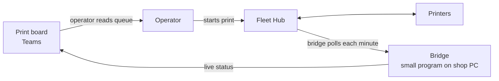

# Connecting the print board to the printers

*One-page stakeholder brief, 2026-09-15. Technical detail is in
[farm-integration-technical.md](farm-integration-technical.md).*

## The problem

The **print board** in Teams knows who wants what and when. **Farm Manager** on
the shop PC knows what the printers are actually doing. Nothing connects them.
A person carries status between the two, so the board says "In progress" when
someone clicked, not when a nozzle is hot, and finished jobs sit unmarked until
noticed.

## The constraint

Farm Manager is closed. Bambu offers no way for other software to read or
drive it. The only supported route is Bambu's **Fleet Hub**, a $600 network
box that exposes the printers to software we write. A printer belongs to Farm
Manager *or* a hub, never both.

The **bridge** is a small program that asks the hub what every printer is doing
and writes the answer into the board's own data. The board then shows real
state beside planned state.

## What we would get, in stages

| Stage | Outcome | Effort |
| --- | --- | --- |
| 1. Live status | Each printer card shows idle, printing with % and time left, finished, error, offline | Hub + about a week |
| 2. Nudges | Board flags jobs the printer says are done, and printers running unscheduled work | Days |
| 3. Auto-complete | Board marks a job complete when the bed is cleared | A day, plus a policy call |
| 4. Start from the board | Operator clicks Start on the board; the printer begins | Weeks; rebuilds Farm Manager's core |

Stages 1 and 2 deliver most of the value. Each stage stands alone.

## What we would give up

Farm Manager's screen for hub-bound printers: its queue, batch controls, video,
and voice alerts. Prints on those machines start from Bambu Studio or the hub's
basic web page until stage 4 exists.

## Cost and risk

| | |
| --- | --- |
| Hub | about $600, one-time, up to 50 printers |
| Developer access | free, online agreement on the shop's Bambu account |
| Stage 1 build | about a week |
| Ongoing | certificate renewal every six months; firmware updates |
| Reversible | yes; a printer moves back to Farm Manager in minutes |

Stages 1 and 2 never change a task or start a print. Worst case is a wrong
badge.

## The decision

1. **Do nothing.** Improve the handoff by convention, e.g. job code in the Farm
   Manager task name.
2. **Pilot.** One hub, two printers, stage 1, judge after a month. About $600
   and a week.
3. **Commit.** Move the fleet and plan through stage 3 or 4.

**Recommendation: pilot.** It answers whether live status changes how the shop
works, for one hub's price, and it can be undone.

## To settle first

Which two printers pilot. Who owns the shop PC and the hub credentials. Whether
operators accept starting pilot prints outside Farm Manager. Whether automation
may ever mark a job complete, or only suggest it.
