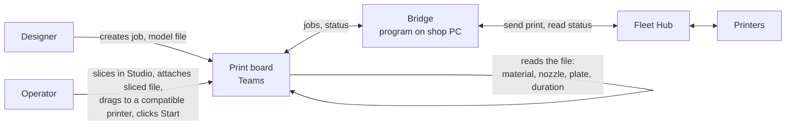

# Connecting the print board to the printers

*Stakeholder brief, 2026-09-15. Technical detail and the full action plan are
in [farm-integration-technical.md](farm-integration-technical.md).*

## The platforms involved

| Platform | What it is | Who uses it today |
| --- | --- | --- |
| **Print board** (Teams tab) | The shop's job list: who asked, what, when it's due, which printer it's planned for | Designers and operators |
| **Bambu Studio** (desktop) | Slices a model into a printable file and sends it to one printer | Operators, some designers |
| **Bambu Handy** (phone) and the **printer screen** | Watch a print, pause it, clear the bed | Operators |
| **Bambu Cloud** | Bambu's account service. Studio and Handy reach the printers through it | In the background |
| **Bambu Farm Manager** (Windows) | Bambu's free fleet dashboard. Closed: no way for other software to connect | Not used |
| **Bambu Fleet Hub** (network box, about $600) | Bambu's only product that lets *our own* software read and drive the printers | Not owned |

## Today

| Step | Designer | Operator |
| --- | --- | --- |
| 1 | Saves the model file to the shared drive | |
| 2 | Creates the job on the **board**: name, jobcode, file path, priority, need-by, material | |
| 3 | | Drags the job onto a printer on the **board**, guesses an ETA from a preset |
| 4 | | Opens the file in **Studio**, slices, picks the printer, sends |
| 5 | | Returns to the **board**, marks the run In progress |
| 6 | | Watches progress on **Handy** or the printer screen |
| 7 | | Clears the bed, marks the run Complete on the **board** |

The board knows nothing the printers know. Material, nozzle, and loaded filament
are typed in by hand. The ETA is a guess. Steps 5 and 7 depend on someone
remembering to come back.

## The design

One workflow, board-driven, with the Fleet Hub supplying what the printers know
and the sliced file supplying what the job needs.

| Step | Designer | Operator | Automatic |
| --- | --- | --- | --- |
| 1 | Creates the job on the **board** with the model file, who, need-by, priority. Same as today | | |
| 2 | | | Board shows every printer's live state, loaded filament, and nozzle, fed from the hub once a minute |
| 3 | | Slices in **Studio**, attaches the sliced file to the job on the **board** | Board reads the file: printer model, nozzle, filaments and colours, plate, print time. ETA comes from the file. Compatible printers light up |
| 4 | | Drags the job onto a compatible printer, clicks **Start** | Bridge checks the circuit's heating limit, maps filaments to slots, sends the print. Run goes In progress on its own. Notifications fire |
| 5 | | Watches progress on the **board** | Errors appear with Bambu's description and ping the operator |
| 6 | | Clears the bed | Board marks the run Complete, frees the printer, and, if enabled, starts the next queued run |

The designer's job does not change. The operator's changes from "slice, send
from Studio, come back and update the board" to "slice, attach, Start." Studio
stays for slicing and calibration. Farm Manager is not used. Handy is not
available on hub printers.

## What is certain and what is not

Every printer fact and command in the design is in Bambu's published Fleet Hub
API, which has been read in full, and every job fact is in the sliced file
format Studio already produces. The parts we build are ordinary software.

| Certain from documentation | Not available | Ours to build, no unknowns |
| --- | --- | --- |
| Printer state, progress, time remaining | Which bed plate is physically installed. The file says which it wants; the operator checks | Reading the sliced file in the board |
| Loaded filament per slot, colour, RFID | Live video. Snapshot images only | Filament matching rules |
| Nozzle size and type | Bambu Handy on hub printers | Staggered starts per circuit |
| Start, pause, stop, confirm bed clear | | Auto-complete and auto-next |
| Error codes with Bambu's descriptions | | |

The one thing documentation cannot settle is how the hub behaves on our network
with our printers. Bambu ships scripts that exercise every call. Week one of
the plan runs them and signs off before board work starts. If the hub fails
acceptance it is returned and nothing else has been spent.

## Delivery

One design, shipped in versions so the shop has something usable at each
point.

| Version | What the shop gets | When |
| --- | --- | --- |
| 1 | Hub installed and accepted. Printers show live state, loaded filament, nozzle on the board. Hand-typed printer fields retire | Weeks 1 to 3 |
| 2 | Operators attach the sliced file. Material, nozzle, plate, and a real ETA fill in. Board flags compatible printers | Week 4 |
| 3 | Start from the board. Staggered starts. In progress set automatically | Weeks 5 to 6 |
| 4 | Auto-complete, error pings, optional auto-next | Week 7 |
| 5 | Studio sending retired. One week running both, then cutover | Week 8 |

## Cost

| | |
| --- | --- |
| Fleet Hub | about $600 one-time, up to 50 printers |
| Bambu developer access | free, online agreement on the shop's Bambu account |
| Development | about 8 weeks, one developer, part time |
| Ongoing | certificate renewal every six months, hub and printer firmware |
| Given up | Bambu Handy on hub printers. Bambu Cloud features. Nothing else in use today |
| Reversible | Yes. A printer moves back to Bambu Cloud in minutes; the hub can be reset |

## Decisions needed

- Approve the hub purchase and the developer agreement on the shop's account.
- Who owns the shop PC the bridge runs on, and the hub credentials.
- Whether the board may start the next queued run on its own, or always wait
  for a click.
