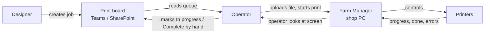
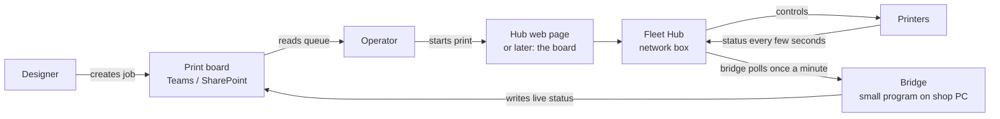

# Connecting the print board to the printers

*Stakeholder version. The developer version is
[farm-integration-technical.md](farm-integration-technical.md).*

Written 2026-09-15 from Bambu Lab's published documentation for Farm Manager
3.0, Fleet Hub firmware 1.01, and the Fleet Hub HTTP API v1.0.0. Nothing here
has been built yet.

## The short version

The shop runs two tools that don't talk to each other. The **print board** in
Teams tracks who asked for what, when it's due, and which printer it's queued
on. **Bambu Farm Manager** on the shop PC drives the printers: uploads files,
starts prints, shows progress, updates firmware.

Today a person carries information between them. The board says a job is "In
progress" because someone clicked it, not because the printer is actually
running. When a print finishes, nothing on the board changes until someone
notices and updates it.

**Farm Manager cannot be connected to anything.** Bambu ships it as a closed
Windows program with no interface for other software. The only supported way to
read or control Bambu printers from our own software is a separate Bambu
product, the **Fleet Hub**, a small network box that costs about $600 and
exposes the printers to software we write.

The catch: a printer talks to Farm Manager *or* to a Fleet Hub, never both. So
"integrating the board with Farm Manager" really means deciding whether to move
some or all printers from Farm Manager onto a Fleet Hub, and then building a
small piece of software (the "bridge") that carries printer status into the
board and, later, board decisions back to the printers.

## What the two tools each do

| | Print board (Teams) | Farm Manager (shop PC) |
| --- | --- | --- |
| Knows who requested a job and why | yes | no |
| Knows the due date and job code | yes | no |
| Knows which printer a job is planned for | yes | only once started |
| Knows whether the printer is actually running | no | yes |
| Knows progress, time remaining, errors | no | yes |
| Can start, pause, stop a print | no | yes |
| Holds the sliced print files | no | yes |
| Usable from anywhere with Teams | yes | shop LAN only |
| Can other software read it | yes (SharePoint) | **no** |

Neither replaces the other. The board is the shop's memory and planning
surface. Farm Manager is the control panel.

## How information moves today

Every arrow into the board on the right-hand side is a person remembering to
do something. That is where jobs sit "In progress" for a day after they came
off the bed, and where the board's "Busy" light means "someone clicked" rather
than "the nozzle is hot".

## How it would move with a Fleet Hub and a bridge

The bridge is the new piece. It is a small program that asks the Fleet Hub
"what is every printer doing?" about once a minute and writes the answer into
the same SharePoint lists the board already reads. The board then shows real
state next to the planned state, and can flag mismatches: a job marked "In
progress" on a printer that reports idle, or a printer that reports finished
with nobody having marked the job complete.

## What we would gain, in stages

Each stage is useful on its own and can be the stopping point.

| Stage | What people see | What it takes |
| --- | --- | --- |
| **1. Live status** | A small live badge on each printer card: idle, printing with percent and time left, paused, finished, error, offline. Grey when the shop PC is off. | Fleet Hub, bridge, two or three new columns on the Printers list, printers moved onto the hub. |
| **2. Nudges** | The board highlights a job the printer says is finished, and a printer that says it's printing while the board shows nothing queued. Nobody's status is changed automatically. | Board-only change once stage 1 exists. |
| **3. Auto-complete** | When a printer finishes and the operator clears the bed, the board marks the job complete on its own. | A shop decision to let automation change task status, plus a setting to turn it off. |
| **4. Start from the board** | Operator picks a queued job on the board, clicks Start, the printer begins. Sliced files live in SharePoint next to the job. | The bridge learns to send files and filament mappings to the hub. This is the heavy stage. |

Stages 1 and 2 give most of the value: the board stops lying about printer
state. Stage 4 effectively rebuilds Farm Manager's core inside our own tools,
which is a real project and only worth it if Farm Manager's screen is something
the shop wants to stop using.

## What we would give up

- **Farm Manager's screen for hub-bound printers.** The Fleet Hub has a basic
  web page for binding printers and updating firmware, and nothing else. Until
  stage 4 exists, operators start prints either from Bambu Studio, which still
  works with hub-bound printers, or from the hub's page. Farm Manager's queue,
  batch controls, live video, and voice alerts are gone for those printers.
- **Bambu Handy on those printers.** Already true under Farm Manager, so no
  change in practice.
- **Simplicity.** A hub and a bridge are two more things that can be off,
  unplugged, or out of date. The bridge runs on the shop PC; if that PC is off
  the board shows stale badges, clearly marked as stale.

## What it costs

| Item | Cost | Notes |
| --- | --- | --- |
| Fleet Hub | about $600 one-time | Sold through resellers. Up to 50 printers per hub. |
| Bambu developer authorization | free | Online agreement on the shop's Bambu account. Business use only, which we are. |
| Bridge software, stage 1 | a few days of development | Python, runs on the shop PC. Bambu supplies working sample code. |
| Board changes, stages 1 and 2 | a few days | New columns and a badge. |
| Stage 3 | a day plus the policy decision | |
| Stage 4 | weeks | File storage, filament matching, error handling. |
| Ongoing | small | Bambu's activation certificate renews every six months. Firmware updates for the hub and printers. |

## Ways to reduce the risk

- **Pilot with two printers.** Bind two machines to a hub, leave the rest on
  Farm Manager, run stage 1 for a month. Farm Manager's own scan shows which
  printers are on which system, so nothing is hidden.
- **Read-only first.** Stages 1 and 2 never change a task or start a print. The
  worst failure is a wrong badge.
- **Stop at any stage.** Each stage stands alone.
- **Reversible.** Unbinding a printer from the hub and re-adding it to Farm
  Manager takes minutes. The hub can be factory reset.

## The decision that has to be made

1. **Do nothing.** Keep Farm Manager and the board as they are. Improve the
   human handoff with conventions, for example putting the board's job code in
   the Farm Manager task name. Zero cost, zero integration.
2. **Pilot a Fleet Hub.** Buy one hub, bind two printers, build stage 1, judge
   the value after a month. Roughly $600 plus a week of development.
3. **Commit.** Move the fleet to the hub and plan through stage 3 or 4.

Recommendation: option 2. It answers the real question, whether live status on
the board changes how the shop works, for the price of one hub, and it can be
undone.

## Questions to settle before starting

- Which two printers pilot, and who owns the shop PC the bridge runs on?
- Who holds the Bambu developer account and the hub credentials? Losing the hub
  password means a factory reset.
- Is the shop willing to start prints from Bambu Studio or the hub's web page
  for pilot printers, instead of Farm Manager?
- At stage 3, should automation ever mark a job complete, or only suggest it?

## Sources

Bambu Lab's [Farm Manager quick start](https://wiki.bambulab.com/en/software/bambu-farm-manager),
[Farm Manager FAQ](https://wiki.bambulab.com/en/software/bambu-farm-faq-troubleshoot),
[Fleet Hub introduction](https://wiki.bambulab.com/en/acc/manual/fleet-hub),
[Fleet Hub developer center](https://bambulab.com/en/fleet-hub/developer), and
the Fleet Hub technical and security white papers and HTTP API v1.0.0, all
current as of September 2026.
