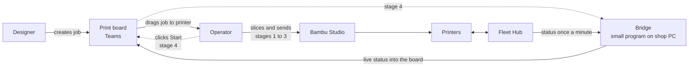

# Connecting the print board to the printers

*Stakeholder brief, 2026-09-15. Technical detail is in
[farm-integration-technical.md](farm-integration-technical.md).*

## The platforms involved

| Platform | What it is | Who uses it today |
| --- | --- | --- |
| **Print board** (Teams tab) | The shop's job list: who asked, what, when it's due, which printer it's planned for | Designers and operators |
| **Bambu Studio** (desktop) | Slices a model into a printable file and sends it to one printer | Operators, some designers |
| **Bambu Handy** (phone) and the **printer screen** | Watch a print, pause it, clear the bed | Operators |
| **Bambu Cloud** | Bambu's account service. Studio and Handy reach the printers through it unless a printer is in LAN-only mode | In the background |
| **Bambu Farm Manager** (Windows) | Bambu's free fleet dashboard: queue, batch controls, live video | **Not used** |
| **Bambu Fleet Hub** (network box, about $600) | Bambu's only product that lets *our own* software read and drive the printers | **Not owned** |

## How work flows today

| Step | Designer | Operator |
| --- | --- | --- |
| 1 | Saves the model file to the shared drive | |
| 2 | Creates the job on the **board**: name, jobcode, file path, priority, need-by | |
| 3 | | Drags the job onto a printer on the **board**, sets an ETA |
| 4 | | Opens the file in **Studio**, slices, sends it to that printer |
| 5 | | Goes back to the **board** and marks the run "In progress" |
| 6 | | Watches progress on **Handy** or the printer screen |
| 7 | | Clears the bed, marks the run "Complete" on the **board** |

Steps 5 and 7 are the problem. The board only knows a print started or finished
because a person came back and said so. When that is forgotten, the board shows
a printer busy that is idle, or a job running that came off the bed hours ago.
The board also guesses the ETA from a preset while Studio knows the real
duration.

## Why the board can't just ask the printers

Bambu locks the printers to its own software. Studio and Handy are allowed to
talk to them; anything we write is not, with one exception: the **Fleet Hub**.
It sits on the shop network, takes ownership of the printers, and gives our
software a secure way to read status and start prints.

Farm Manager does not help here. It is a dashboard for humans with no way for
other software to connect. Adopting it would give operators a nicer screen
than Studio for running many printers, and nothing more. It also can't share a
printer with a Fleet Hub, so adopting it now would have to be undone later.

A printer belongs to one controller at a time: Bambu Cloud (Studio and Handy),
Farm Manager, or a Fleet Hub. Moving a printer to the hub means Handy stops
working for it. Studio keeps working, in its local-network mode.

## How work would flow with a hub

The **bridge** is a small program on the shop PC. It asks the hub what every
printer is doing and writes the answer into the board's own data. The board
then shows real state next to planned state.

| Stage | What changes for the operator | What changes for the designer |
| --- | --- | --- |
| **1. Live status** | Each printer card shows idle, printing with percent and time left, finished, error, offline. Step 6 above can happen on the board. | Sees whether their job is actually printing without asking |
| **2. Nudges** | Board flags a run the printer says is finished, or a printer running something the board doesn't know about. Step 5 is prompted, not remembered. | Same |
| **3. Auto-complete** | When the bed is cleared, the board marks the run complete. Step 7 becomes just clearing the bed. | Gets the "complete" notification without waiting on anyone |
| **4. Start from the board** | Drags the job onto a printer and clicks Start. Studio drops out of the operator's day; step 4 and 5 vanish. | **Must attach a sliced file** when creating the job, so slicing moves to the designer or to a slicing step before the board |

Stages 1 to 3 change what the board *knows*. Only stage 4 changes what people
*do*, and it moves slicing upstream, which is a workflow decision on its own.

## Cost and risk

| | |
| --- | --- |
| Fleet Hub | about $600 one-time, up to 50 printers |
| Bambu developer access | free, online agreement on the shop's Bambu account, business use |
| Stage 1 build | about a week |
| Stages 2 and 3 | days each |
| Stage 4 | weeks |
| Ongoing | certificate renewal every six months, hub and printer firmware |
| Given up on hub-bound printers | Bambu Handy. Bambu Cloud features. Nothing else that is in use today |
| Reversible | Yes. A printer moves back to Bambu Cloud in minutes; the hub can be reset |

Stages 1 to 3 never start or stop a print. The worst failure is a wrong badge
or a wrong "complete" that an operator reopens.

## The decision

1. **Do nothing.** Keep board plus Studio. Accept that steps 5 and 7 depend on
   people.
2. **Pilot.** One hub, two printers, stage 1, judge after a month. About $600
   and a week.
3. **Commit.** All printers on the hub, plan through stage 3 or 4.

**Recommendation: pilot.** It answers whether live status on the board changes
how the shop works, for one hub's price, and it can be undone.

## To settle first

- Which two printers pilot. Same model keeps it simple.
- Who owns the shop PC the bridge runs on, and the hub credentials.
- Whether operators accept losing Handy on the pilot printers.
- At stage 3, whether the board may mark a run complete on its own or only
  suggest it.
- At stage 4, who slices.
