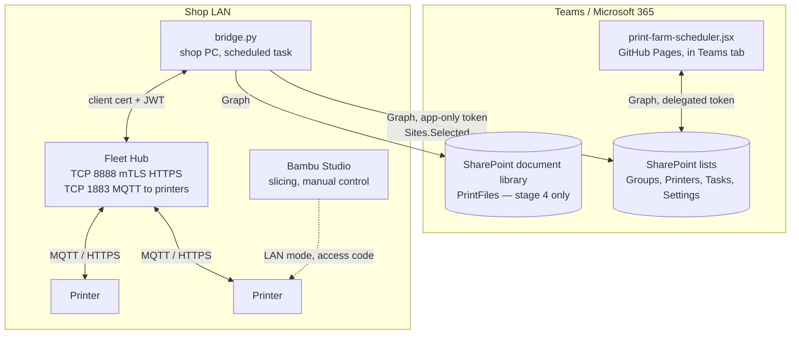

# Printer integration: technical design

*Developer version. The stakeholder version is
[farm-integration-strategy.md](farm-integration-strategy.md). Read that first
for the why; this file is the how.*

Status: **design only, nothing built.** Written 2026-09-15 against Farm Manager
3.0, Fleet Hub firmware 01.01.00.00, and *Bambu Fleet Hub HTTP API v1.0.0*
(2026-05-20). The API PDF is behind Bambu developer authorization and is not
checked in; the shop's copy is in the developer account.

## Constraints that shape everything

1. **Farm Manager has no API.** No HTTP, no export, no database access, no
   webhook. Its only outward-facing surface is the printer-side protocol, and
   Bambu's authorization-control firmware rejects print and control commands
   that don't come from Bambu software. Integration with Farm Manager itself is
   not possible. Everything below goes through Fleet Hub instead.
2. **A printer binds to exactly one controller.** Farm Manager, a Fleet Hub, or
   Bambu Cloud. Binding to the hub removes the printer from Farm Manager. The
   hub's `scan_printers` response reports `connect: farm` and the owning
   `server_id`, so mixed fleets are visible.
3. **The hub requires mutual TLS with a Bambu-issued client certificate** on
   TCP 8888, is LAN-only, and uses a self-signed server certificate. A browser
   page cannot call it: no client cert in the handshake, no CORS, and Teams
   users may be off the shop LAN. Hence a bridge process on-prem.
4. **The board's save layer diffs by object identity** and its printer `Busy`
   state is derived from tasks (see
   [data-model.md](data-model.md#busy-is-derived-and-automation-never-overrules-a-person)).
   The bridge must not fight either. It writes to SharePoint through Graph, not
   through the app, and it writes only to columns the app treats as read-only.
5. **No build step, no server** is a settled decision for the *app*
   ([decisions.md](decisions.md)). The bridge is a separate on-prem process
   that never serves the app and never holds an app secret the browser needs.
   The new fact that justifies it is constraint 3.

## Components



- **Bridge**: one Python script, `requests` only, built from Bambu's demo code
  (`base_lib`, `hub`, `printer_control` folders). Runs as a Windows scheduled
  task every 60 s, or as a loop with a 60 s sleep. Holds the client cert, hub
  account, and a Graph app registration secret. Lives in its own small repo or
  a `bridge/` folder here; it is not part of the Pages deploy either way.
- **Hub**: bought, activated once, bound to the pilot printers. Its optional
  web UI is enabled for binding and firmware.
- **Board**: reads new live columns and renders them. Never calls the hub.

## Stage 1: live status, read-only

### Data flow

```mermaid
sequenceDiagram
    autonumber
    participant P as Printers
    participant H as Fleet Hub
    participant B as Bridge (shop PC)
    participant G as Microsoft Graph
    participant SP as SharePoint Printers list
    participant UI as Board (Teams)

    P->>H: MQTT status reports (continuous)
    loop every 60 s
        B->>H: GET /v1/hub/devices (Bearer JWT, client cert)
        H-->>B: devices[] with report_status
        B->>B: map gcode_state, mc_percent, mc_remaining_time,<br/>subtask_name, online, hms/err -> live record
        B->>B: diff against last written values (local cache)
        B->>G: PATCH /sites/{site}/lists/Printers/items/{id}/fields<br/>(only rows that changed)
        G->>SP: update LiveState, LiveProgress, LiveJob, LiveEtaMinutes, LiveError, LiveUpdated
    end
    loop on the board's existing poll
        UI->>G: GET Printers items
        G-->>UI: rows incl. live columns
        UI->>UI: render badge; grey when LiveUpdated older than 3 min
    end
```

### Hub authentication, as the bridge does it

```mermaid
sequenceDiagram
    participant B as Bridge
    participant H as Hub
    B->>H: POST /v1/hub/login/local/tickets {user_name}
    H-->>B: {ticket_id, ticket = base64({challenge, salt})}
    B->>B: hash = hex(sha256(hex(sha256(hex(sha256(pw)) + salt)) + challenge))
    B->>H: POST /v1/hub/login {user_name, password: hash, ticket_id}
    H-->>B: {token}  (short-lived JWT)
    Note over B: cache token; on code 6 or 7 (invalid/expired) repeat
```

The one-time activation (ticket from hub, `PUT` to Bambu cloud with the
Activation Key, `PUT` activation code back to hub with the new API account) is
done by Bambu's `hub/activate.py` and is not part of the bridge.

### Field mapping

Source is one element of `devices[]` from `GET /v1/hub/devices`.

| Live column | Type | From | Rule |
| --- | --- | --- | --- |
| `Serial` | Text | `dev_sn` | Operator-entered once per printer; the join key. Never written by the bridge. |
| `LiveState` | Choice | `online`, `mqtt_status`, `report_status.gcode_state` | `Offline` if `online` false or `mqtt_status` != 2, else one of `IDLE PREPARE RUNNING PAUSE FINISH FAILED`. |
| `LiveProgress` | Number | `report_status.mc_percent` | 0 to 100. Null unless state is RUNNING or PAUSE. |
| `LiveEtaMinutes` | Number | `report_status.mc_remaining_time` | Seconds ÷ 60, rounded. Null unless RUNNING. |
| `LiveJob` | Text | `report_status.subtask_name` | The name given when the print started. Blank when IDLE. |
| `LiveError` | Text | `report_status.err2.err_code` else `err`, plus first `hms` entry as hex | Blank when none. Description via `GET /v1/hub/hms` or `/v1/hub/device_error` can wait for stage 2. |
| `LiveUpdated` | DateTime | bridge clock, UTC | Written on every successful poll for every bound printer, even if nothing else changed. This is the staleness signal. |

`LiveUpdated` is the one column written on every poll, so the "only changed
rows" optimisation applies to the other five. Six columns on the Printers
list, matching the schema rule in [CLAUDE.md](../CLAUDE.md): SharePoint column,
`COLS` entry, both mappers, and `checkSchema()` will refuse to load until all
three are done. The board never writes these; `printerToRow` should omit them
so a PATCH from the app can't overwrite a fresher bridge value.

### Matching printers to rows

By `Serial` only. Names drift; serials don't. A device the hub reports whose
serial matches no row is logged once and skipped. A row with a serial the hub
doesn't report gets `LiveState = Offline` and a fresh `LiveUpdated`, so an
unbound or unplugged printer shows as offline rather than frozen.

### Graph access for the bridge

App-only. Register a second Entra app (not the board's delegated one), grant
`Sites.Selected`, and grant that app `write` on the one SharePoint site via the
`/sites/{id}/permissions` endpoint. Client secret or, better, a certificate,
stored in Windows Credential Manager on the shop PC. This is the first app-only
credential in the project; document it in
[authentication.md](authentication.md) when built.

### Board changes

- `COLS.printers` gains the six columns; `printerFromRow` reads them into
  `printer.live = {state, progress, etaMinutes, job, error, updated}`;
  `printerToRow` leaves them out.
- A `LiveBadge` in the printer header: dot colour by state, `RUNNING 42% · 1h
  10m`, greyed with a "stale" tooltip when `updated` is older than 3 minutes.
- `checkSchema()` picks the new names up from `COLS` automatically.
- `BUILD` bump. Update [ui-reference.md](ui-reference.md) and
  [data-model.md](data-model.md) in the same PR.

Nothing in the mutation handlers or the reconciliation effect changes. `live`
is data on the printer object that the diff layer will happily PATCH if a
handler touches the printer for another reason, which is harmless because
`printerToRow` omits it.

## Stage 2: nudges

Board-only. Two derived flags, computed in render, no new storage:

| Condition | Flag shown |
| --- | --- |
| Task `In progress` on printer whose `live.state` is `IDLE` or `FINISH` for more than N minutes | "Printer reports finished" on the task card |
| Printer `live.state` is `RUNNING` and no task on it is `In progress` | "Printing unscheduled work" on the printer card |
| `live.state` is `FAILED` or `live.error` non-blank | Error chip on the printer card with the code; description lookup via the bridge writing `LiveErrorText` if wanted |

Optional bridge addition: match `LiveJob` against task `jobcode` or `title` and
write the matched `TaskID` into a `LiveTaskId` column, which makes the first
flag exact instead of positional.

## Stage 3: auto-complete

The first place automation changes a *task*. Gate it behind a Settings-list
toggle, default off. Rule: when a printer's `live.state` moves `RUNNING` →
`FINISH` and then the operator clears the bed (state returns to `IDLE` after
`FINISH`, or the bridge observes `bed_clean` accepted), the bridge marks the
matched `In progress` task `Complete`, via Graph. The board's reconciliation
effect then flips the printer from `Busy` to `Ready` on its own, which is the
existing rule doing its job.

The bridge, not the board, does the write, because only the bridge sees the
transition. It must set the same columns the app sets on completion (check
`completedAt` or equivalent in `taskToRow` at build time) so the history table
renders the row normally.

This is a task mutation from outside the app. The identity-diff rule doesn't
apply (the write is a PATCH straight to Graph), but the board's next poll must
treat the row as changed. Confirm the board's list refresh picks up
externally-modified rows before shipping stage 3; today it assumes it is the
only writer.

## Stage 4: dispatch from the board

The heavy stage. Only worth doing if the shop wants to retire Farm Manager's
screen for hub-bound printers.

```mermaid
sequenceDiagram
    autonumber
    participant D as Designer
    participant UI as Board
    participant SP as SharePoint
    participant B as Bridge
    participant H as Hub
    participant P as Printer

    D->>UI: attach sliced .gcode.3mf to task
    UI->>SP: upload to PrintFiles library, store item id on task (FileRef)
    Note over UI: operator sets task In progress on a printer with a Serial
    UI->>SP: Task.Status = In progress, DispatchState = Requested
    loop every 60 s
        B->>SP: query tasks where DispatchState = Requested
        B->>SP: download 3mf
        B->>B: unzip, read Metadata/slice_info.config:<br/>filaments (id, type, tray_info_idx, color), nozzle diameter, plate
        B->>H: GET /v1/hub/devices/{sn}  (AMS trays, nozzle)
        B->>B: map each filament id -> {ams_id, slot_id} by type + colour;<br/>fail if no match or nozzle mismatch
        B->>H: PUT /v1/hub/devices/print  multipart: file (or file_hash), print_cmd, dev_sns=[sn]
        alt code 0
            B->>SP: DispatchState = Sent
        else 1051 busy / 1053 bad mapping / other
            B->>SP: DispatchState = Failed, DispatchError = message
        end
    end
    H->>P: MQTT print command; printer downloads 3mf over HTTPS
    P->>H: status RUNNING
    Note over B,SP: stage 1 poll shows RUNNING within a minute
```

What stage 4 needs beyond the bridge:

- **A document library** for `.gcode.3mf` files and a `FileRef` on tasks. Files
  are single-plate only (hub error 1004); the board should reject multi-plate
  uploads by checking for more than one `Metadata/plate_*.gcode` entry, which
  needs a zip reader in the browser. Deferred: accept anything and let the
  bridge fail it with a clear `DispatchError`.
- **Filament mapping.** `print_cmd.filament_slot` is an array indexed by
  slicer filament id minus 1, each entry `{ams_id, slot_id}`. External spool is
  `ams_id 255, slot_id 0` (left extruder on H2D is 254). AMS units are 0–3,
  slots 0–3. AMS-HT is 128–135. Match on `tray_type` first, then nearest
  `tray_color`; if the printer's loaded filament doesn't satisfy the file,
  fail rather than guess. This is the part Farm Manager 3.0 calls "Start All"
  and it is most of the work.
- **Calibration options** in `print_cmd.print_option`: booleans for P1/A1/X1,
  0/1/2 modes for H and P2 series. Default to the printer model's "auto".
- **A `DispatchState` choice** on tasks: blank, `Requested`, `Sent`, `Failed`,
  plus `DispatchError` text. The board sets `Requested` when a task with a
  `FileRef` goes `In progress` on a printer with a `Serial`; otherwise the
  operator is still starting prints by hand and nothing changes.
- **Cached reprints.** The hub keys files by MD5. Store the hash on the task
  after first send and use `file_hash` instead of re-uploading for repeat jobs.

## Pilot rollout

1. Buy the hub. Accept the developer agreement on the shop's Bambu account,
   generate the Activation Key, issue one client cert from a 4096-bit RSA key
   generated on the shop PC. Private key never leaves that PC.
2. Wire the hub to the shop switch. Read its IP from `status.txt` on a USB
   stick or SSDP. Activate with `hub/activate.py`. Create the web account with
   `user/add_web_user.py` so operators have a page to bind printers from.
3. In Farm Manager, delete the two pilot printers. In the hub web page, Search
   Nearby, Connect both. Confirm `GET /v1/hub/devices` lists them with
   `mqtt_status 2`.
4. Add `Serial` and the five live columns to the Printers list. Land the
   `COLS` and mapper PR with the `LiveBadge`. Enter the two serials.
5. Register the bridge's Entra app with `Sites.Selected`; grant it the site.
6. Run the bridge by hand once, confirm the two rows update, then schedule it.
7. Live with it for a month. Then decide on stages 2–4 and the rest of the
   fleet.

## Failure modes

| Failure | Effect | Handling |
| --- | --- | --- |
| Shop PC off or bridge crashed | `LiveUpdated` stops advancing | Board greys badges after 3 min. No data corruption. |
| Hub unreachable | Same | Bridge logs, retries next tick. Don't write `Offline` for all printers on a hub error; leave rows untouched so staleness shows instead. |
| JWT expired | code 7 / HTTP 401 | Re-login, retry once. |
| Graph throttled (429) | Row not updated this tick | Honour `Retry-After`, skip to next tick. |
| Hub cert expired | mTLS handshake fails | Reissue from developer center; the hub is bound to the developer *account*, not the individual cert. |
| Hub password lost | Nothing works | Factory reset and re-activate; re-bind printers. Keep the password in the shop's password manager. |
| Printer rebound to Farm Manager | Hub reports it gone | Row shows `Offline`. Expected in a mixed fleet. |
| Stage 4: bad filament mapping | Hub returns 1053 | `DispatchState = Failed` with message; task stays `In progress`, operator decides. |

## Security notes

- Client cert private key, hub API password, and Graph secret live only on the
  shop PC, in Credential Manager or a file readable by the scheduled task's
  account. None of it goes in this repo. `.gitignore` the bridge config.
- The bridge talks to the hub on the LAN only. It never exposes a port. Bambu's
  guidance not to expose Farm Manager to the internet applies equally here.
- Graph permission is `Sites.Selected` scoped to one site, not
  `Sites.ReadWrite.All`. The bridge can't reach other SharePoint content.
- Hub model cache is plaintext at rest (Bambu says encryption is planned). Keep
  the hub in the locked shop.

## Open questions

- Which two printers pilot, and are they the same model? A single model keeps
  the stage 4 filament and calibration logic to one branch.
- Does the board's refresh pick up rows modified by another writer between its
  own saves? Needed for stage 1 correctness and essential for stage 3. Check
  the persistence section of [architecture.md](architecture.md) and test with
  a manual SharePoint edit before building the bridge.
- Bambu also describes a "Local Server SDK" (Windows binary or Docker) under
  application-only access on the
  [third-party integration page](https://wiki.bambulab.com/en/software/third-party-integration).
  It may be the same engine behind Farm Manager and might not require the hub.
  Unverified; worth one email to devpartner@bambulab.com before buying.
- Hub firmware and the API are v1.0. Expect field names to move; pin the
  bridge to the fields listed above and log anything unexpected rather than
  failing.

## Reference: hub endpoints the bridge uses

| Stage | Method | Path | Purpose |
| --- | --- | --- | --- |
| 1 | POST | `/v1/hub/login/local/tickets` | challenge |
| 1 | POST | `/v1/hub/login` | JWT |
| 1 | GET | `/v1/hub/devices` | all printer status |
| 1 | GET | `/v1/hub/captain` | hub health, storage |
| 2 | GET | `/v1/hub/hms`, `/v1/hub/device_error` | error text |
| 2 | GET | `/v1/hub/file/info?file_path=liveview/{sn}/liveview.jpeg` | snapshot |
| 3 | POST | `/v1/hub/devices/{sn}/opt` `{opt: bed_clean}` | confirm removal |
| 4 | PUT | `/v1/hub/devices/print` | upload and start |
| 4 | GET | `/v1/hub/file/info?is_encrypted=False&num=100` | cached hashes |
| setup | GET | `/v1/hub/local_printers`, `/v1/hub/scan_printers` | discovery |
| setup | PUT / DELETE | `/v1/hub/bind` | bind, unbind |

Ports: TCP 8888 API (mTLS), TCP 1883 hub-to-printer MQTT, TCP 443 hub web UI,
UDP 1990/1991/2021/2022 SSDP. Outbound from the hub after activation: optional
NTP only.
