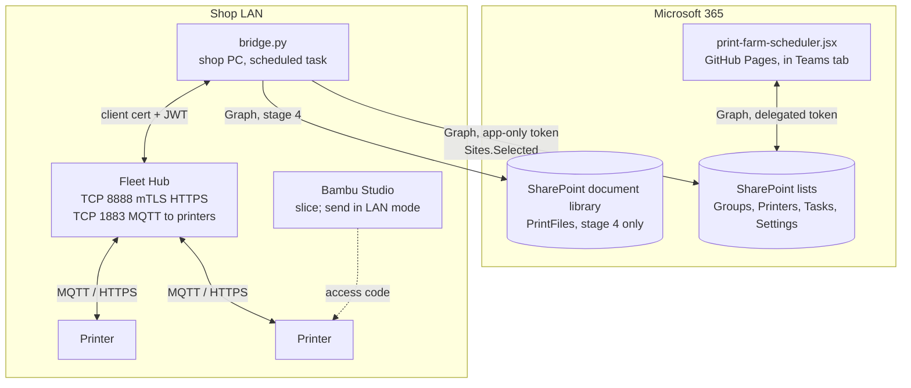

# Printer integration: technical design

*Developer version. The stakeholder version is
[farm-integration-strategy.md](farm-integration-strategy.md). Read that first
for the why; this file is the how.*

Status: **design only, nothing built.** Written 2026-09-15 against Fleet Hub
firmware 01.01.00.00 and *Bambu Fleet Hub HTTP API v1.0.0* (2026-05-20). The
API PDF is behind Bambu developer authorization and is not checked in; the
shop's copy is in the developer account.

## Starting point

The shop runs the **board** and **Bambu Studio**. Farm Manager is not in use.
Printers are reached from Studio either through Bambu Cloud (bound to a Bambu
account, visible in Handy) or in LAN-only mode with an access code. The board
has no knowledge of printer state; operators set task status by hand after
acting in Studio.

## Who touches which platform, by stage

| Platform | Today | Stages 1 to 3 | Stage 4 |
| --- | --- | --- | --- |
| Board | Designer creates jobs. Operator assigns, sets In progress and Complete by hand | Same, plus live badges. Stage 3 sets Complete automatically | Designer attaches sliced file. Operator assigns and clicks Start. Studio leaves the operator's loop |
| Bambu Studio | Operator slices and sends to printer | Operator slices and sends, in LAN mode with access code | Whoever slices; no longer sends |
| Bambu Handy | Operator monitors | **Unavailable** on hub-bound printers | Unavailable |
| Printer screen | Operator clears bed, pauses | Same | Same |
| Bambu Cloud | Binds printers to the shop account | Hub-bound printers leave it | Same |
| Farm Manager | Not used | Not used | Not used |
| Fleet Hub | None | Owns the printers. Web UI for binding and firmware only | Same, plus receives print commands from the bridge |
| Bridge | None | Polls hub, writes live columns | Also reads dispatch requests and sends prints |

## Constraints that shape everything

1. **Bambu's authorization-control firmware rejects print and control commands
   from non-Bambu software.** Studio, Handy, Farm Manager, Bambu Connect, and
   Fleet Hub are allowed. Nothing we write is, except through the hub's API.
   Developer Mode on the printer would reopen the raw protocol but is
   unsupported and LAN-only; not pursued.
2. **Farm Manager has no API** and can't share a printer with a hub. It plays
   no part in this design. If the shop later wants its dashboard for printers
   *not* on the hub, that is independent of everything here.
3. **A printer binds to exactly one controller**: Bambu Cloud, Farm Manager, or
   a hub. The hub's `local_printers?only_can_bind=true` returns only printers
   that are not bound to Handy, not in LAN-only mode, and not on another hub or
   Farm Manager. A cloud-bound printer must be logged out on its screen before
   binding; a LAN-only printer must have LAN-only switched off. After binding,
   Studio still reaches the printer with the LAN-mode access code.
4. **The hub requires mutual TLS with a Bambu-issued client certificate** on
   TCP 8888, is LAN-only, and uses a self-signed server certificate. A browser
   page cannot call it. Hence a bridge process on the shop LAN.
5. **The board's save layer diffs by object identity** and derives printer
   `Busy` from tasks (see
   [data-model.md](data-model.md#busy-is-derived-and-automation-never-overrules-a-person)).
   The bridge writes to SharePoint through Graph, never through the app, and
   only to columns the app treats as read-only.
6. **No build step, no server** is settled for the *app*
   ([decisions.md](decisions.md)). The bridge is a separate on-prem process
   that never serves the app and holds no secret the browser needs. The new
   fact justifying it is constraint 4.

## Components



- **Bridge**: one Python script, `requests` only, built from Bambu's demo code
  (`base_lib`, `hub`, `printer_control`). Windows scheduled task every 60 s.
  Holds the client cert, hub API account, and a Graph app registration
  credential. Lives in `bridge/` here or its own repo; not part of the Pages
  deploy either way.
- **Hub**: bought, activated once, bound to the pilot printers. Web UI enabled
  for binding and firmware.
- **Board**: reads new live columns and renders them. Never calls the hub.

## Stage 1: live status, read-only

### Data flow

```mermaid
sequenceDiagram
    autonumber
    participant Op as Operator
    participant S as Bambu Studio
    participant P as Printers
    participant H as Fleet Hub
    participant B as Bridge
    participant SP as SharePoint Printers list
    participant UI as Board

    Op->>S: slice, send to printer (LAN mode, access code)
    S->>P: print file
    P->>H: MQTT status reports (continuous)
    loop every 60 s
        B->>H: GET /v1/hub/devices
        H-->>B: devices[] with report_status
        B->>B: map to live record; diff against last write
        B->>SP: PATCH changed rows: LiveState, LiveProgress, LiveJob,<br/>LiveEtaMinutes, LiveError; LiveUpdated on every row
    end
    UI->>SP: existing poll
    UI->>UI: badge per printer; grey when LiveUpdated older than 3 min
    Op->>UI: still sets In progress / Complete by hand
```

### Hub authentication, as the bridge does it

```mermaid
sequenceDiagram
    participant B as Bridge
    participant H as Hub
    B->>H: POST /v1/hub/login/local/tickets {user_name}
    H-->>B: {ticket_id, ticket = base64({challenge, salt})}
    B->>B: hash = hex(sha256(hex(sha256(hex(sha256(pw)) + salt)) + challenge))
    B->>H: POST /v1/hub/login {user_name, password: hash, ticket_id}
    H-->>B: {token}  (short-lived JWT)
    Note over B: cache; on code 6 or 7 repeat
```

One-time activation (ticket from hub, `PUT` to Bambu cloud with the Activation
Key, activation code back to hub with the new API account) is done once with
Bambu's `hub/activate.py` and is not part of the bridge.

### Field mapping

Source is one element of `devices[]` from `GET /v1/hub/devices`.

| Live column | Type | From | Rule |
| --- | --- | --- | --- |
| `Serial` | Text | `dev_sn` | Operator-entered once per printer; the join key. Never written by the bridge |
| `LiveState` | Choice | `online`, `mqtt_status`, `report_status.gcode_state` | `Offline` if `online` false or `mqtt_status` != 2, else `IDLE PREPARE RUNNING PAUSE FINISH FAILED` |
| `LiveProgress` | Number | `report_status.mc_percent` | Null unless RUNNING or PAUSE |
| `LiveEtaMinutes` | Number | `report_status.mc_remaining_time` | Seconds ÷ 60. Null unless RUNNING |
| `LiveJob` | Text | `report_status.subtask_name` | Name given at send time. Blank when IDLE |
| `LiveError` | Text | `report_status.err2.err_code` else `err`; first `hms` entry as hex | Blank when none |
| `LiveUpdated` | DateTime | bridge clock, UTC | Written every poll for every bound printer. The staleness signal |

Six columns on the Printers list, following the schema rule in
[CLAUDE.md](../CLAUDE.md): SharePoint column, `COLS` entry, both mappers.
`printerToRow` must omit them so an app PATCH can't overwrite a fresher bridge
value.

### Matching printers to rows

By `Serial` only. A hub device with no matching row is logged once and
skipped. A row whose serial the hub doesn't report gets `LiveState = Offline`
and a fresh `LiveUpdated`.

### Graph access for the bridge

App-only. Second Entra app registration, `Sites.Selected`, granted `write` on
the one site via `/sites/{id}/permissions`. Certificate credential preferred
over client secret, stored in Windows Credential Manager on the shop PC. First
app-only credential in the project; document in
[authentication.md](authentication.md) when built.

### Board changes

- `COLS.printers` gains the six columns; `printerFromRow` reads them into
  `printer.live`; `printerToRow` leaves them out.
- A `LiveBadge` in the printer header: dot by state, `RUNNING 42% · 1h 10m`,
  greyed with a "stale" tooltip past 3 minutes.
- `BUILD` bump. Update [ui-reference.md](ui-reference.md) and
  [data-model.md](data-model.md) in the same PR.

Mutation handlers and the reconciliation effect are untouched.

## Stage 2: nudges

Board-only, computed in render, no new storage.

| Condition | Flag |
| --- | --- |
| Task `In progress` on a printer whose `live.state` is `IDLE` or `FINISH` for more than N minutes | "Printer reports finished" on the task card |
| Printer `live.state` is `RUNNING` with no task `In progress` on it | "Printing unscheduled work" on the printer card |
| `live.state` is `FAILED` or `live.error` non-blank | Error chip with the code |

Optional: bridge matches `LiveJob` to task `jobcode` or `title` and writes
`LiveTaskId`, making the first flag exact. This depends on the operator naming
the plate in Studio with the jobcode, which is a convention to agree on.

## Stage 3: auto-complete

First automation that changes a *task*. Behind a Settings-list toggle, default
off. When a printer goes `RUNNING` → `FINISH` → `IDLE` (bed cleared), the
bridge marks the matched `In progress` task `Complete` via Graph. The board's
reconciliation then flips the printer `Busy` → `Ready` on its own.

The bridge must set whatever completion columns `taskToRow` sets, so the
history table renders normally. Confirm before shipping that the board's
refresh picks up rows modified by another writer; today it assumes it is the
only one.

## Stage 4: dispatch from the board

Only worth doing if the shop wants Studio out of the operator's loop. Moves
slicing to the designer or a pre-board step.

```mermaid
sequenceDiagram
    autonumber
    participant D as Designer
    participant UI as Board
    participant SP as SharePoint
    participant B as Bridge
    participant H as Hub
    participant P as Printer

    D->>UI: create job, attach sliced .gcode.3mf
    UI->>SP: upload to PrintFiles library; FileRef on task
    Note over UI: operator drags job to a printer with a Serial, clicks Start
    UI->>SP: Task.Status = In progress, DispatchState = Requested
    loop every 60 s
        B->>SP: tasks where DispatchState = Requested
        B->>SP: download 3mf
        B->>B: read Metadata/slice_info.config: filaments, nozzle, plate
        B->>H: GET /v1/hub/devices/{sn}  (loaded AMS trays, nozzle)
        B->>B: map filament ids -> {ams_id, slot_id}; fail on mismatch
        B->>H: PUT /v1/hub/devices/print (file or file_hash, print_cmd, dev_sns)
        alt code 0
            B->>SP: DispatchState = Sent
        else 1051 busy / 1053 mapping / other
            B->>SP: DispatchState = Failed, DispatchError
        end
    end
    H->>P: MQTT print command; printer downloads file
    P->>H: RUNNING
    Note over B,SP: stage 1 poll shows RUNNING within a minute
```

Beyond the bridge, stage 4 needs:

- **A document library** for `.gcode.3mf` and a `FileRef` on tasks.
  Single-plate only (hub error 1004).
- **Filament mapping.** `print_cmd.filament_slot[i]` is `{ams_id, slot_id}` for
  slicer filament `i+1`. External spool `255/0` (H2D left extruder `254/0`),
  AMS `0–3`/`0–3`, AMS-HT `128–135`/`0`. Match `tray_type` then nearest
  `tray_color`; fail rather than guess. Most of the work is here.
- **Calibration options** in `print_option`: booleans for P1/A1/X1, `0/1/2`
  modes for H and P2 series. Default to auto per model.
- **`DispatchState`** choice on tasks (`Requested`, `Sent`, `Failed`) plus
  `DispatchError`. Set only when a task with a `FileRef` goes `In progress` on
  a printer with a `Serial`; otherwise the Studio path continues unchanged.
- **Cached reprints.** Store the hub's MD5 on the task; use `file_hash` on
  repeats.

## Pilot rollout

1. Buy the hub. Accept the developer agreement on the shop's Bambu account,
   generate the Activation Key, issue one client cert from a 4096-bit RSA key
   generated on the shop PC. Private key never leaves that PC.
2. Wire the hub to the shop switch. Read its IP from `status.txt` on a USB
   stick or via SSDP. Activate with `hub/activate.py`. Create the web account
   with `user/add_web_user.py`.
3. On each pilot printer's screen: log out of the Bambu account (unbinds Handy)
   and make sure LAN-only mode is off. In the hub web page, Search Nearby,
   Connect. Confirm `GET /v1/hub/devices` shows `mqtt_status 2`.
4. In Studio, re-add each pilot printer by IP and access code so operators can
   still send prints.
5. Add `Serial` and the five live columns to the Printers list. Land the
   `COLS`, mapper, and `LiveBadge` PR. Enter the two serials.
6. Register the bridge's Entra app with `Sites.Selected`; grant the site.
7. Run the bridge by hand once, confirm the two rows update, then schedule it.
8. Live with it for a month. Then decide on stages 2 to 4 and the rest of the
   fleet.

## Failure modes

| Failure | Effect | Handling |
| --- | --- | --- |
| Shop PC off or bridge crashed | `LiveUpdated` stops | Badges grey after 3 min. No data corruption |
| Hub unreachable | Same | Log, retry next tick. Don't write `Offline` on a hub error; leave rows so staleness shows |
| JWT expired | code 7 / HTTP 401 | Re-login, retry once |
| Graph 429 | Row skipped this tick | Honour `Retry-After` |
| Client cert expired | mTLS fails | Reissue from developer center; the hub is bound to the developer account, not the cert |
| Hub password lost | Nothing works | Factory reset, re-activate, re-bind. Keep it in the shop's password manager |
| Printer moved back to cloud | Hub reports it gone | Row shows `Offline`. Expected in a mixed fleet |
| Stage 4: bad filament mapping | Hub 1053 | `DispatchState = Failed` with message; task stays `In progress` |

## Security notes

- Client cert private key, hub API password, and Graph credential live only on
  the shop PC. Nothing in this repo; `.gitignore` the bridge config.
- The bridge talks to the hub on the LAN only and exposes no port.
- Graph permission is `Sites.Selected` on one site, not `Sites.ReadWrite.All`.
- Hub model cache is plaintext at rest (encryption planned by Bambu). Keep the
  hub in the locked shop.

## Open questions

- Which two printers pilot, and are they the same model.
- Does the board's refresh pick up rows modified by another writer? Needed for
  stage 1 correctness, essential for stage 3. Test with a manual SharePoint
  edit before building the bridge.
- Bambu's [third-party integration page](https://wiki.bambulab.com/en/software/third-party-integration)
  describes a "Local Server SDK" (Windows binary or Docker) under
  application-only access. It may be the engine behind Farm Manager and might
  not need the hub. Unverified; one email to devpartner@bambulab.com before
  buying.
- Hub firmware and API are v1.0. Pin the bridge to the fields above; log
  anything unexpected rather than failing.

## Reference: hub endpoints the bridge uses

| Stage | Method | Path | Purpose |
| --- | --- | --- | --- |
| 1 | POST | `/v1/hub/login/local/tickets` | challenge |
| 1 | POST | `/v1/hub/login` | JWT |
| 1 | GET | `/v1/hub/devices` | all printer status |
| 1 | GET | `/v1/hub/captain` | hub health, storage |
| 2 | GET | `/v1/hub/hms`, `/v1/hub/device_error` | error text |
| 2 | GET | `/v1/hub/file/info?file_path=liveview/{sn}/liveview.jpeg` | snapshot |
| 3 | POST | `/v1/hub/devices/{sn}/opt` `{opt: bed_clean}` | confirm removal |
| 4 | PUT | `/v1/hub/devices/print` | upload and start |
| 4 | GET | `/v1/hub/file/info?is_encrypted=False&num=100` | cached hashes |
| setup | GET | `/v1/hub/local_printers`, `/v1/hub/scan_printers` | discovery |
| setup | PUT / DELETE | `/v1/hub/bind` | bind, unbind |

Ports: TCP 8888 API (mTLS), TCP 1883 hub-to-printer MQTT, TCP 443 hub web UI,
UDP 1990/1991/2021/2022 SSDP. Outbound from the hub after activation: optional
NTP only.
