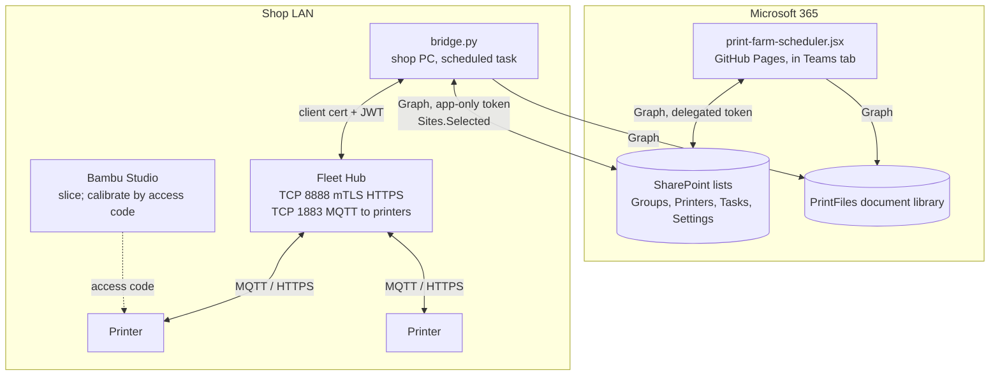

# Printer integration: technical design and action plan

*Developer version. The stakeholder version is
[farm-integration-strategy.md](farm-integration-strategy.md).*

Status: **design and plan, nothing built.** Written 2026-09-15 against Fleet
Hub firmware 01.01.00.00 and *Bambu Fleet Hub HTTP API v1.0.0* (2026-05-20).
The API PDF is behind Bambu developer authorization and is not checked in; the
shop's copy is in the developer account. Every hub call and field named below
is taken from that document.

## Starting point

The shop runs the **board** and **Bambu Studio**. Farm Manager is not in use
and plays no part here: it has no API and cannot share a printer with a hub.
Printers are reached from Studio through Bambu Cloud or in LAN-only mode.
The board has no knowledge of printer state.

## Target workflow

```mermaid
sequenceDiagram
    autonumber
    participant D as Designer
    participant UI as Board
    participant SP as SharePoint
    participant B as Bridge (shop PC)
    participant H as Fleet Hub
    participant P as Printer
    participant Op as Operator

    D->>UI: New job: model file path, who, need-by, priority (unchanged)
    loop every 60 s
        B->>H: GET /v1/hub/devices
        B->>SP: live state, loaded filament, nozzle per printer
    end
    Op->>Op: slice in Studio, export .gcode.3mf
    Op->>UI: attach .gcode.3mf to the job
    UI->>UI: read Metadata/slice_info.config and gcode header
    UI->>SP: requirements + duration on task; file to PrintFiles library
    Op->>UI: drag job to a compatible printer, click Start
    UI->>SP: run In progress, DispatchState = Requested
    B->>SP: read Requested runs
    B->>B: circuit heating limit; filament slot mapping
    B->>H: PUT /v1/hub/devices/print
    H->>P: print
    P->>H: RUNNING ... FINISH
    B->>SP: DispatchState = Sent; live state
    UI->>Op: progress, errors with text
    Op->>P: clear bed
    P->>H: IDLE
    B->>SP: run Complete
    Note over UI: printer Ready; optional auto-next
```

## Who touches which platform

| Platform | Today | Target |
| --- | --- | --- |
| Board | Designer creates jobs. Operator assigns, sets In progress and Complete by hand | Designer creates jobs, unchanged. Operator attaches the sliced file, assigns, clicks Start. Status is automatic |
| Bambu Studio | Operator slices and sends | Operator slices only. Calibration and manual control by access code. No sending |
| Bambu Handy | Operator monitors | Unavailable on hub printers |
| Printer screen | Clear bed, pause | Same |
| Bambu Cloud | Binds printers | Hub printers leave it |
| Farm Manager | Not used | Not used |
| Fleet Hub | None | Owns the printers. Web UI for binding and firmware |
| Bridge | None | Polls hub, writes to SharePoint, dispatches prints |

## What the hub provides, mapped to the design

| Need | Hub API | Field or call |
| --- | --- | --- |
| Printer state | yes | `report_status.gcode_state`: IDLE PREPARE RUNNING PAUSE FINISH FAILED; `online`; `mqtt_status` |
| Progress, remaining | yes | `mc_percent`, `mc_remaining_time` (s), `layer_num`/`total_layer_num` |
| Current job name | yes | `subtask_name` |
| Loaded filament per slot | yes | `ams.ams[].tray[]`: `tray_type`, `tray_color` ARGB, `tray_info_idx`, `tag_uid` (RFID). External: `vt_tray` (P1/A1) or `vir_slot` (X/H/P2) |
| Nozzle | yes | `nozzle_diameter`, `nozzle_type`; `device.nozzle.info[]` with `type` code `H[S|H|U][00|01|05]` and `diameter` |
| Errors | yes | `hms[]`, `err`/`err2`; text via `GET /v1/hub/hms` and `/v1/hub/device_error` |
| Start a print | yes | `PUT /v1/hub/devices/print`, multipart: `file` or `file_hash`, `print_cmd`, `dev_sns[]` |
| Pause, resume, stop, confirm bed clear | yes | `POST /v1/hub/devices/{sn}/opt` with `opt` |
| Set filament on a slot | yes | same endpoint, `ams_filament_setting` / `external_filament_setting` |
| Snapshot | yes | `GET /v1/hub/file/info?file_path=liveview/{sn}/liveview.jpeg` |
| Firmware | yes | upload and push; use the hub web UI instead |
| **Installed bed plate** | **no** | Not in the payload. Plate the *file* wants comes from the file |
| **Live video** | **no** | Snapshot only |
| **Staggered starts** | **no** | Bridge logic on `gcode_state == PREPARE` counts |
| Bambu Handy | lost | Hub printers leave Bambu Cloud |

## What the sliced file provides

`.gcode.3mf` is a zip. The board reads it in the browser at attach time; no
hub involved.

| Need | Where | Field |
| --- | --- | --- |
| Printer model | `Metadata/slice_info.config` | `<metadata key="printer_model_id">` |
| Nozzle diameter and flow | same | `<filament nozzle_diameter volume_type>`; `<nozzle>` when present |
| Filaments: type, colour, Bambu ID, grams | same | `<filament id type color tray_info_idx used_g>` |
| Plate gcode path | same | `Metadata/plate_N.gcode`; single plate only, hub error 1004 otherwise |
| Estimated time | `Metadata/plate_N.gcode` header | `; total estimated time:` |
| Bed plate wanted | same header | `; curr_bed_type =` |

Zip reading in the browser: `DecompressionStream("deflate-raw")` is native in
current Chromium and Edge (Teams desktop is Edge WebView2), so a small inline
zip walker needs no library. If that proves brittle, fflate from a CDN is
consistent with the no-build decision.

## Certainty

Everything in the two tables above except the three "no" rows is documented
behaviour. Bambu's demo code exercises every call used. The parts we build are
ordinary software with no research component:

- reading XML and a gcode header from a zip
- a poll loop that diffs and PATCHes SharePoint rows
- a filament matching rule: same `tray_type`, then nearest `tray_color`, fail
  rather than guess
- a counter of printers in `PREPARE` per group, compared to a per-group limit
- the state machine `Requested → Sent → (RUNNING) → FINISH → IDLE → Complete`

The unverifiable item is the hub itself on this network. Phase 1 below runs
Bambu's scripts against it and signs off before any board change. That is
acceptance, not experiment: pass criteria are written down, and failure means
returning a $600 device with nothing else spent.

Two internal checks are required early because they affect design, not
feasibility: whether the board's refresh picks up rows written by another
process (Phase 0), and the exact completion columns `taskToRow` writes so the
bridge can set the same ones (Phase 5).

## Components



- **Bridge**: one Python script, `requests` only, built from Bambu's demo code.
  Windows scheduled task every 60 s. Holds the client cert, hub API account,
  and a Graph app credential in Windows Credential Manager. Lives in `bridge/`
  here; not part of the Pages deploy.
- **Hub**: activated once, owns the printers. Web UI for binding and firmware.
- **Board**: reads live columns, parses attached files, sets `DispatchState`.
  Never calls the hub.

## Schema additions

All follow the rule in [CLAUDE.md](../CLAUDE.md): SharePoint column, `COLS`
entry, both mappers, `checkSchema()` passes.

**Printers.** Written by the bridge; `printerToRow` omits them.

| Column | Type | Source |
| --- | --- | --- |
| `Serial` | Text | Operator, once. Join key |
| `LiveState` | Choice | `Offline` if not online or `mqtt_status != 2`, else `gcode_state` |
| `LiveProgress` | Number | `mc_percent` |
| `LiveEtaMinutes` | Number | `mc_remaining_time / 60` |
| `LiveJob` | Text | `subtask_name` |
| `LiveError` | Text | `err2.err_code` or `err`; first `hms` as hex |
| `LiveUpdated` | DateTime | bridge clock, every poll. Staleness signal |
| `LoadedFilament` | Multi-line text | JSON: `[{ams, slot, type, color, idx, rfid}]` including external |
| `LiveNozzleSize` | Text | `nozzle_diameter` |
| `LiveNozzleType` | Text | decoded `device.nozzle.info[0].type` |

The existing `NozzleSize`, `NozzleType`, `NozzleMaterial`, `PrintMaterial`
fields become read-only on the card when `Serial` is set, showing the live
values. `BedType` stays manual.

**Tasks.**

| Column | Type | Source |
| --- | --- | --- |
| `FileRef` | Text | Library item id of the attached `.gcode.3mf` |
| `FileHash` | Text | MD5, for hub cached reprints |
| `ReqPrinterModel` | Text | from file |
| `ReqNozzle` | Text | from file, e.g. `0.4 HF` |
| `ReqFilaments` | Multi-line text | JSON: `[{id, type, color, idx, grams}]` |
| `ReqPlate` | Text | from gcode header |
| `EstMinutes` | Number | from gcode header; drives ETA |
| `DispatchState` | Choice | blank, `Requested`, `Sent`, `Failed` |
| `DispatchError` | Text | hub message |

**Settings.** `AutoComplete` (bool), `AutoNext` (bool), `HeatingLimit`
per group (stored on Groups as `HeatingLimit` Number, default unlimited).

**PrintFiles** document library, one file per task, named `<TaskID>.gcode.3mf`.

## Bridge behaviour

**Auth.** Ticket then login per the API: `hash =
hex(sha256(hex(sha256(hex(sha256(pw)) + salt)) + challenge))`. Cache the JWT;
on code 6 or 7 re-login once.

**Poll.** `GET /v1/hub/devices`. For each device with a matching `Serial`,
build the live record, compare to the last written values in a local JSON
cache, PATCH only changed rows, but always write `LiveUpdated`. Rows with a
serial the hub doesn't report get `Offline`. On hub unreachable, write nothing.

**Dispatch.** Read tasks where `DispatchState == Requested`. For each:

1. Skip if the group's count of printers in `PREPARE` is at `HeatingLimit`;
   leave `Requested`, try next tick.
2. Download the file (or reuse `FileHash` if the hub's
   `GET /v1/hub/file/info?is_encrypted=False&num=100` lists it).
3. Build `filament_slot[]` from `ReqFilaments` against `LoadedFilament`:
   match `type`, then nearest colour by RGB distance under a threshold; if any
   filament has no match, `Failed` with a message naming it.
4. `print_option`: booleans for P1/A1/X1; mode `2` (auto) for H and P2 series.
5. `PUT /v1/hub/devices/print`. Code 0 → `Sent`, store `FileHash`. 1051 (busy or
   bed not cleared), 1053 (mapping) or other → `Failed`, `DispatchError`.

Slot encoding: external `ams_id 255, slot_id 0` (H2D left extruder `254/0`);
AMS `0–3`/`0–3`; AMS-HT `128–135`/`0`; unused `255/255`.

**Completion.** When a printer's state goes `RUNNING → FINISH → IDLE` and
`AutoComplete` is on, set the matched run `Complete` with the same columns
`taskToRow` writes. The board's reconciliation flips the printer to `Ready`.
If `AutoNext` is on and a `Not started` run is queued on that printer, set it
`Requested`.

**Errors.** On `FAILED` or a new `hms` entry, look up the text and write
`LiveError`. The board pings the operator through the existing activity-feed
mechanism.

## Board behaviour

- **Attach sliced file.** An **Attach** control on the job card and in the
  detail modal, operator view only, accepting `.gcode.3mf`. The designer's
  New job form is unchanged and still takes the model file path. On attach:
  upload to PrintFiles via Graph, parse in the browser, fill the `Req*`
  columns, `EstMinutes`, and material. ETA on a run = start time plus
  `EstMinutes`, replacing the preset buttons when a file is present. Reject
  multi-plate files with a message. Re-attaching replaces the file and
  re-parses.
- **Live badge** on each printer: state, percent, minutes, greyed past 3 min
  stale. Loaded filament as colour chips with type. Nozzle from live fields.
- **Compatibility.** When dragging a job, highlight printers where model
  matches, nozzle matches, and every required filament type is loaded.
  Others still accept the drop, marked with the mismatch.
- **Start.** On a run with a `FileRef` on a printer with a `Serial`, the
  status menu's In progress becomes **Start**, which sets `In progress` and
  `DispatchState = Requested`. Without a file or serial, the old manual path is
  unchanged.
- **Dispatch feedback.** `Requested` shows a spinner, `Sent` clears it,
  `Failed` shows `DispatchError` with a Retry that resets to `Requested`.
- **Confirm removal** button on a `FINISH` printer, calling nothing itself:
  it sets a flag the bridge turns into `bed_clean`. Optional; clearing the bed
  on the printer screen does the same.

Mutation handlers keep the identity rule. `live` and `Req*` data ride on the
existing objects and are omitted from the app's `toRow` where the bridge
owns them.

## Action plan

| Phase | Work | Done when | Effort |
| --- | --- | --- | --- |
| **0. Access** | Accept the developer agreement on the shop's Bambu account. Generate Activation Key. Generate 4096-bit RSA key on the shop PC, issue client cert. Order hub. Register bridge Entra app, `Sites.Selected`, grant the site. Test: edit a Printers row in SharePoint by hand and confirm the open board reflects it | Cert and key on the shop PC; Graph app can PATCH a test row; board refresh behaviour known | 1 day plus shipping |
| **1. Hub acceptance** | Wire hub. Read IP from USB `status.txt`. Run `hub/activate.py`, `user/add_web_user.py`. On each printer: log out of Bambu account, LAN-only off. Bind all via hub web UI. Re-add each in Studio by IP and access code. Run `printer_control/device_get_one.py` on every printer and `device_print.py` on one with a test plate | All printers `mqtt_status 2`; status fields present; one test print started from a script and completed; Studio still reaches each printer | 2 days |
| **2. Schema** | Add the Printers, Tasks, Groups, Settings columns and the PrintFiles library. `COLS`, mappers, `checkSchema()`. Enter serials | Board loads clean with the new columns; docs updated | 2 days |
| **3. Bridge read** | Poll loop, auth, diff cache, Graph writes, scheduled task. Board live badge, filament chips, live nozzle, spec fields read-only for hub printers | Every printer card shows live state within 60 s of a change; badge greys when the bridge is stopped | 4 days |
| **4. File intake** | Attach control for operators, browser parse, `Req*` and `EstMinutes`, ETA from duration, compatibility highlight | An operator attaches a sliced file and the job shows model, nozzle, filaments, plate, time without typing | 4 days |
| **5. Dispatch** | Bridge dispatch loop, filament mapping, heating limit, `FileHash` reuse, error write-back. Board Start, spinner, Failed with Retry. Confirm `taskToRow` completion columns | Operator drags and clicks Start; printer begins within 90 s; run is In progress; a deliberate colour mismatch fails with a clear message; two simultaneous starts in a group with limit 1 stagger | 6 days |
| **6. Automation** | Auto-complete, auto-next, error text and pings, confirm-removal button | A finished print whose bed is cleared marks itself Complete and frees the printer; with `AutoNext` on the next run starts | 3 days |
| **7. Cutover** | One week running the board path with Studio sending still allowed. Then retire Studio sending. Update [ui-reference.md](ui-reference.md), [data-model.md](data-model.md), [authentication.md](authentication.md), [operations.md](operations.md) | A week of shop use with no manual status edits needed | 1 week elapsed, 1 day work |

About 23 working days plus one week of parallel running. Each phase ships as
its own PR with a `BUILD` bump where code changes.

## Failure modes in operation

| Failure | Effect | Handling |
| --- | --- | --- |
| Shop PC off or bridge crashed | `LiveUpdated` stops; `Requested` runs wait | Badges grey after 3 min; Start shows spinner with "bridge not responding" after 3 min |
| Hub unreachable | Same | Log, retry; write nothing |
| JWT expired | code 7 / 401 | Re-login, retry once |
| Graph 429 | Row skipped | Honour `Retry-After` |
| Client cert expired | mTLS fails | Reissue from developer center; hub is bound to the developer account, not the cert |
| Hub password lost | Nothing works | Factory reset, re-activate, re-bind. Keep in the shop's password manager |
| Filament not loaded for a job | 1053 or pre-check | `Failed` naming the filament; operator loads it, clicks Retry |
| Bed not cleared | 1051 | `Failed` "clear the bed"; Retry |
| Printer moved back to cloud | Hub reports it gone | `Offline`; expected |

## Security

- Client cert private key, hub API password, Graph credential: shop PC only,
  Credential Manager. Nothing in this repo; `bridge/config` gitignored.
- Bridge exposes no port; talks to the hub on the LAN and to Graph outbound.
- Graph permission `Sites.Selected` on one site.
- Hub model cache is plaintext at rest (encryption planned by Bambu). Hub stays
  in the locked shop.

## Open decisions, not open questions

- `AutoNext` default on or off.
- `HeatingLimit` per group, from the electrician's circuit map.
- Whether to also send Bambu one email about the "Local Server SDK" on the
  [third-party integration page](https://wiki.bambulab.com/en/software/third-party-integration),
  which might remove the hub. Optional; does not block the plan.

## Reference: hub endpoints used

| Method | Path | Purpose |
| --- | --- | --- |
| POST | `/v1/hub/login/local/tickets`, `/v1/hub/login` | auth |
| GET | `/v1/hub/devices`, `/v1/hub/devices/{sn}` | status |
| GET | `/v1/hub/captain` | hub health, storage |
| GET | `/v1/hub/hms`, `/v1/hub/device_error` | error text |
| GET | `/v1/hub/file/info?file_path=liveview/{sn}/liveview.jpeg` | snapshot |
| GET | `/v1/hub/file/info?is_encrypted=False&num=100` | cached file hashes |
| PUT | `/v1/hub/devices/print` | upload and start |
| POST | `/v1/hub/devices/{sn}/opt` | pause, resume, stop, bed_clean, filament setting |
| GET | `/v1/hub/local_printers`, `/v1/hub/scan_printers` | discovery |
| PUT / DELETE | `/v1/hub/bind` | bind, unbind |

Ports: TCP 8888 API (mTLS), TCP 1883 hub-to-printer MQTT, TCP 443 hub web UI,
UDP 1990/1991/2021/2022 SSDP. Outbound from the hub after activation: optional
NTP only.
